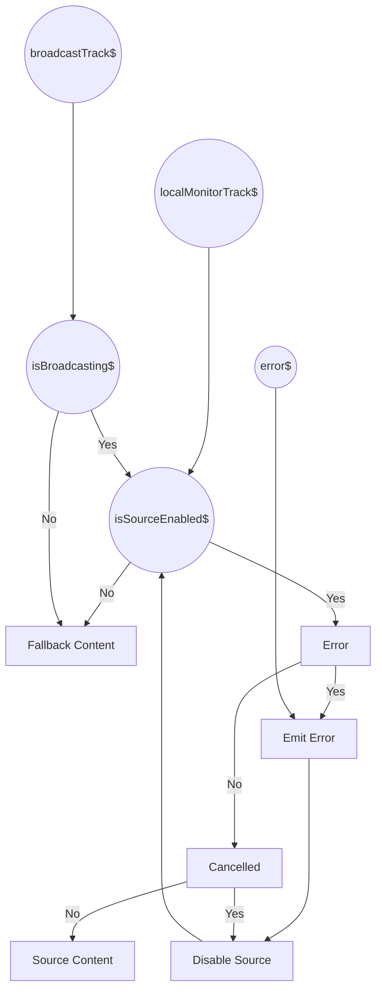

```mermaid
flowchart TD
    SourceContent[Source Content]
    FallbackContent[Fallback Content]
    IsSourceEnabled$((isSourceEnabled$))
    IsBroadcasting$((isBroadcasting$))
    LocalMonitorTrack((localMonitorTrack$))
    BroadcastTrack((broadcastTrack$))
    Error[Error]
    Error$((error$))
    EmitError[Emit Error]
    Cancelled[Cancelled]
    DisableSource[Disable Source]
    IsSourceEnabled$ -- No --> FallbackContent
    IsSourceEnabled$ -- Yes --> Error
    Error -- Yes --> EmitError
    Error$ ----> EmitError
    EmitError ----> DisableSource
    Error -- No --> Cancelled
    Cancelled -- Yes --> DisableSource
    Cancelled -- No --> SourceContent
    DisableSource ----> IsSourceEnabled$
    LocalMonitorTrack ----> IsSourceEnabled$
    BroadcastTrack ----> IsBroadcasting$
    IsBroadcasting$ -- Yes --> IsSourceEnabled$
    IsBroadcasting$ -- No --> FallbackContent
```
